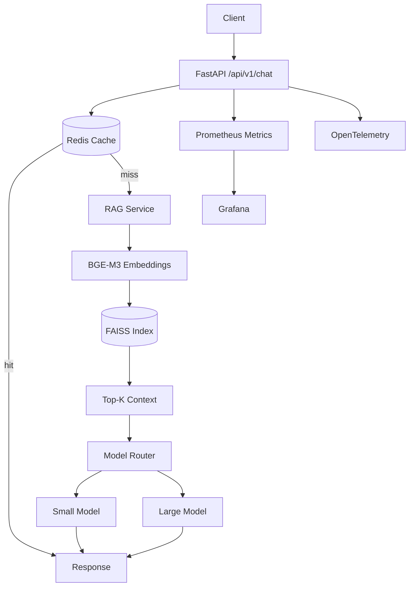

# Production RAG Service

A production-oriented Retrieval-Augmented Generation (RAG) service built to explore the engineering problems behind reliable LLM applications: **retrieval quality, model routing, latency, caching, observability, and evaluation**.

> Portfolio project for an AI/LLM engineering role. The project intentionally prioritizes measurable system behavior over a large UI or a collection of AI demos.

## What I built

- **FastAPI** service with versioned `/api/v1` endpoints
- Local semantic retrieval using **BGE-M3 + FAISS**
- Deterministic **small/large model routing** based on query complexity
- **Redis** response caching with cache-aside behavior
- Graceful degradation when Redis is unavailable
- **Prometheus** application metrics
- **OpenTelemetry** tracing hooks for request, retrieval, and inference spans
- **Grafana** dashboard provisioning for latency, request rate, model traffic, and cache hit rate
- Reproducible retrieval and routing evaluation datasets
- Unit tests for routing, validation, cache behavior, and cache-key normalization
- Docker Compose development environment

## Architecture



### Request flow

1. Normalize the user query and calculate a SHA-256 cache key.
2. Check Redis for a cached response.
3. On a cache miss, retrieve the top 3 knowledge-base chunks using normalized BGE-M3 embeddings and FAISS inner-product search.
4. Route the question to the small or large model using deterministic complexity rules.
5. Generate an answer constrained to the retrieved context.
6. Cache the response and return routing + latency metadata.
7. Export application metrics and create OpenTelemetry spans when an OTLP endpoint is configured.

## Engineering decisions

### 1. Why cache the final answer?

The current workload is a policy-assistant style workload where identical questions are likely to recur. Caching the final response avoids both retrieval and LLM inference on repeated requests.

Redis is treated as an **optimization, not a correctness dependency**. If Redis is unavailable, the service falls back to the normal RAG path.

### 2. Why deterministic model routing?

The router is deliberately simple and explainable. Short factual questions use the small tier; comparison, analysis, recommendation, and long questions use the large tier.

This creates a measurable baseline for a future learned router or classifier while making the quality/cost trade-off visible in the API response.

### 3. Why measure retrieval and inference separately?

End-to-end latency alone hides the bottleneck. The service records retrieval and LLM latency independently so that optimization work can target the dominant component.

The current benchmark shows that LLM generation dominates retrieval latency, which makes **inference optimization, routing, caching, and batching** more promising next experiments than prematurely optimizing the vector index.

### 4. Why FAISS instead of a managed vector database?

The knowledge base is intentionally small. FAISS keeps the benchmark self-contained and fast to reproduce locally. A production deployment could replace the vector-store implementation with OpenSearch or another persistent vector-search backend without changing the RAG service interface.

## Evaluation

### Retrieval baseline

The included benchmark contains **31 questions** over a small synthetic company-policy knowledge base.

| Metric | Result |
|---|---:|
| Recall@1 | **100.0%** |
| Recall@3 | **100.0%** |
| Recall@5 | **100.0%** |
| Mean retrieval latency | **157.53 ms** |
| Mean LLM latency | **745.43 ms** |
| Mean end-to-end latency | **902.96 ms** |

These results are a **baseline for this small dataset**, not a claim of general RAG quality. The next meaningful experiment is to increase dataset diversity and compare embeddings, chunking, hybrid retrieval, and reranking.

Full report: [`evaluation/REPORT.md`](evaluation/REPORT.md)

### Model routing evaluation

The routing dataset contains 20 labeled questions covering factual, comparison, analysis, recommendation, and long-query cases.

Run:

```bash
make routing-report
```

The evaluator writes `evaluation/routing_results.json` so routing decisions can be inspected individually rather than reporting accuracy alone.

## Observability

Prometheus metrics include:

- HTTP request count and latency
- Retrieval request count, latency, and number of returned documents
- LLM request count, errors, and latency by model
- Redis hits/misses/errors and operation latency

Grafana is provisioned automatically with a dashboard containing request rate, HTTP p95 latency, LLM traffic, LLM p95 latency, cache hit rate, and retrieval p95 latency.

OpenTelemetry spans cover the important application boundaries:

```text
HTTP request
  ├── cache.get
  ├── rag.retrieval
  └── llm.inference
```

Set `OTEL_EXPORTER_OTLP_ENDPOINT` to connect the service to an OTLP-compatible collector.

## API

### `POST /api/v1/chat`

```json
{
  "message": "How many days of annual leave do employees receive?"
}
```

Example response shape:

```json
{
  "answer": "...",
  "model": "gpt-5-nano",
  "model_tier": "small",
  "routing_reason": "simple_query",
  "latency_ms": 123.45,
  "generation_latency_ms": 119.20
}
```

### `POST /api/v1/search`

Returns the top retrieved chunks and their similarity scores. This endpoint makes retrieval behavior independently inspectable.

### `GET /api/v1/health`

Returns `ok` when Redis is reachable and `degraded` when the cache is unavailable. The application can continue serving requests during a Redis outage.

### `GET /metrics`

Prometheus scrape endpoint.

## Run locally

### 1. Configure environment

```bash
cp .env.example .env
```

Set `OPENAI_API_KEY` and, if desired, change `SMALL_MODEL` / `LARGE_MODEL`.

### 2. Start the stack

```bash
docker compose up --build
```

Services:

| Service | Address |
|---|---|
| API | `http://localhost:8000` |
| API docs | `http://localhost:8000/docs` |
| Prometheus | `http://localhost:9090` |
| Grafana | `http://localhost:3000` |
| Redis | `localhost:6379` |

### 3. Smoke test

```bash
curl http://localhost:8000/api/v1/health
curl http://localhost:8000/api/v1/search \
  -H 'Content-Type: application/json' \
  -d '{"message":"How many annual leave days do employees receive?"}'
```

### 4. Run tests

```bash
python -m pip install -r requirements.txt
make test
```

### 5. Run evaluations

```bash
make routing-report
```

The full RAG evaluation requires the configured model API and can be run with:

```bash
make eval
```

## Project structure

```text
app/
├── api/            # HTTP routes and dependency wiring
├── cache/          # Redis cache abstraction
├── core/           # configuration
├── llm/            # model interface, client adapter, router
├── monitoring/     # Prometheus + OpenTelemetry
├── retrieval/      # loading, chunking, vector search
├── schemas/        # API contracts
└── services/       # RAG and LLM orchestration

data/              # synthetic policy knowledge base
evaluation/         # datasets, evaluators, reports
tests/              # unit tests
monitoring/         # Prometheus and Grafana configuration
```

## Limitations and next steps

This is a portfolio-scale system, not a production deployment. Important next experiments are:

1. Compare embedding models and chunking strategies on a larger labeled dataset.
2. Add hybrid BM25 + vector retrieval and a reranker.
3. Add retrieval-level caching and measure cache hit-rate under load.
4. Replace deterministic routing with an evaluated classifier or learned router.
5. Benchmark concurrent inference with **Triton or Ray Serve**, including batching and GPU utilization.
6. Add an OTLP collector and persistent trace storage.
7. Add load testing and p95/p99 SLO-oriented benchmarks.
8. Move the vector index to a persistent service such as OpenSearch for multi-instance deployment.

## Why this project

The project is intentionally centered on the engineering gap between **"an LLM can answer this"** and **"an AI feature can operate reliably as a service."** The main focus is therefore not prompt cleverness, but measurable behavior across retrieval, routing, caching, latency, evaluation, and observability.
